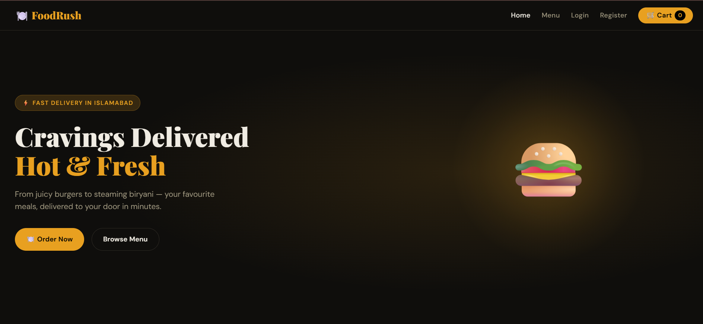
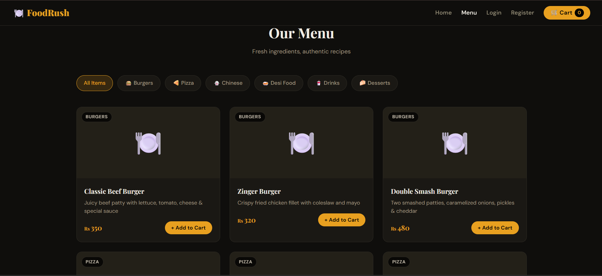
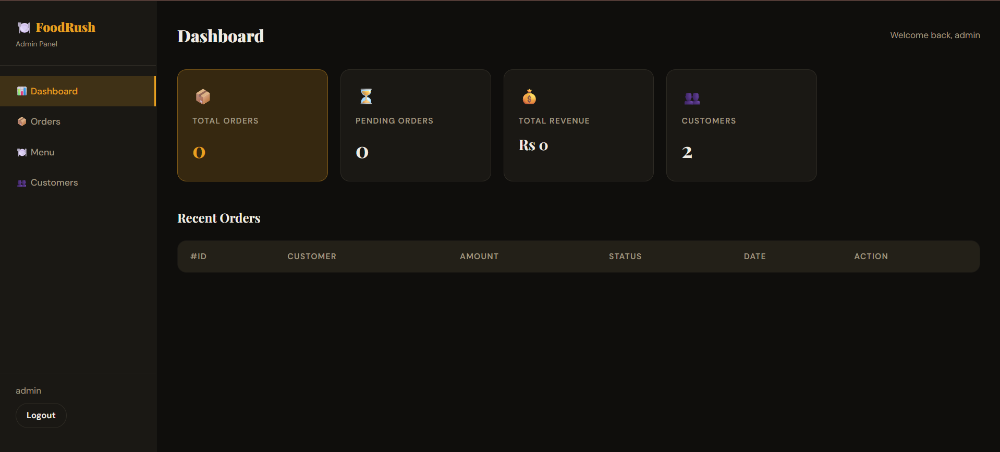
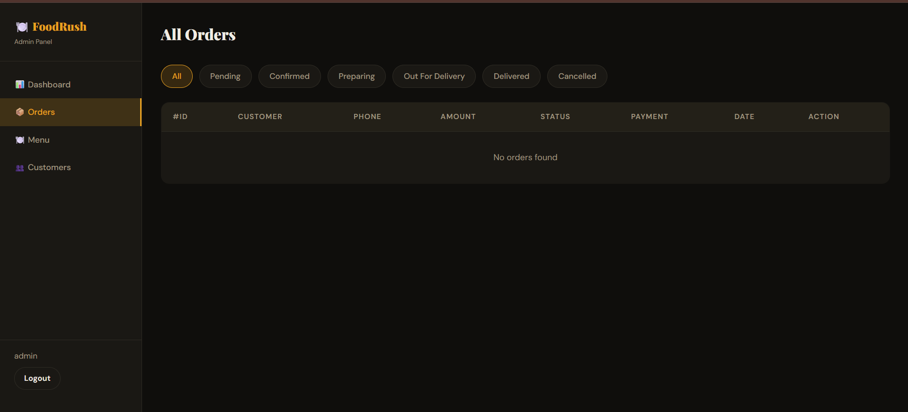

# FoodRush – Food Ordering System

A full-stack food ordering platform developed using Python, Flask, SQL, HTML, CSS, and JavaScript. The system allows customers to browse menus, place orders, manage carts, and track deliveries while providing administrators with powerful tools to manage orders, customers, menu items, and business analytics.

## Overview

FoodRush simulates a real-world online food delivery platform. The project demonstrates database design, backend development, frontend development, user authentication, and business management workflows.

This project was developed to strengthen practical skills in:

* Python Development
* SQL Database Management
* Flask Web Framework
* Database Design
* Full-Stack Web Development
* User Authentication
* CRUD Operations
* Data Management and Reporting

---

## Features

### Customer Module

* User Registration and Login
* Secure Authentication
* Browse Food Categories
* Search and Explore Menu Items
* Shopping Cart Functionality
* Checkout System
* Multiple Payment Options
* Order Tracking
* Order History Management

### Admin Module

* Admin Authentication
* Dashboard Analytics
* Revenue Monitoring
* Customer Management
* Order Management
* Menu Management
* Order Status Updates
* Business Reporting

---

## Database Features

This project demonstrates practical SQL and database concepts including:

* Relational Database Design
* Primary and Foreign Keys
* Data Integrity Management
* Customer Records Management
* Order Processing System
* Product Catalog Management
* Transaction Handling
* Complex Database Relationships

---

## Technology Stack

### Backend

* Python
* Flask

### Database

* SQL Database
* Relational Database Design

### Frontend

* HTML5
* CSS3
* JavaScript

---

## System Workflow

1. Customer creates an account.
2. Customer browses menu items.
3. Products are added to the cart.
4. Order is placed through checkout.
5. Order information is stored in the database.
6. Admin manages and updates order status.
7. Customer tracks order progress.

---

## Skills Demonstrated

* Python Programming
* SQL Queries
* Database Design
* Flask Application Development
* Authentication Systems
* CRUD Operations
* Session Management
* Data Validation
* Frontend Development
* Full-Stack Development

---

## Screenshots

### Home Page

### Menu Page

### Admin Dashboard

### Order Management

---

## Future Improvements

* Payment Gateway Integration
* Email Notifications
* Real-Time Order Tracking
* REST API Development
* Mobile Application Support
* Docker Deployment
* Cloud Database Integration

---

## Author

Hashmat Ullah

BS Artificial Intelligence Student

Interested in Data Analysis, Machine Learning, Artificial Intelligence, Database Systems, and Full-Stack Development.
